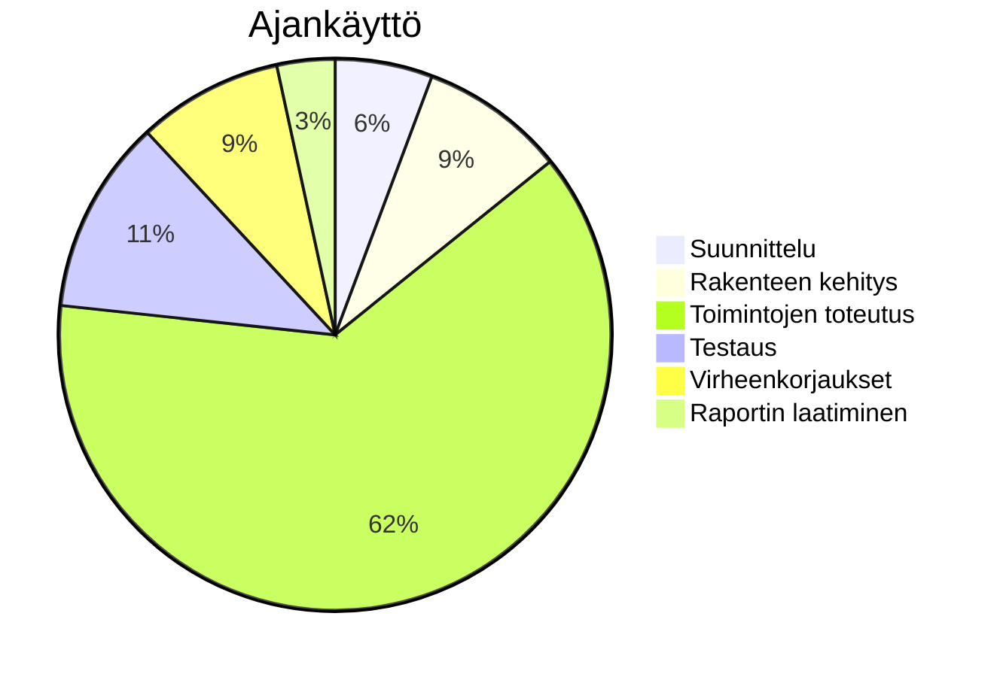

# Loppuraportti

## REACT NATIVE SOVELLUS (OPETUSPELI)

### Iryna Sula

### Yleistä

• Aiheeni oli tehdä peli. Valitsin kieltenopiskelupelin, jossa lapsi voi tehdä tehtäviä ja saada niistä pisteitä. Kun hän on tehnyt kaikki tehtävät, seuraava aihe avautuu. Tein React Native -sovelluksen käyttäen Node.js:ää, Knexiä ja SQL:ää.

• Opin React Nativen (expo framework) aika hyvin. Minun pitäisi paremmin opetella svg-kuvien tekemistä, tämä osuus ei onnistunut minulla.

• Ajankäyttö: miten ajankäyttösi jakautui projektityössä? Jos mahdollista pyri kuvaamaan ajankäyttö
kaavion avulla.

# Käyttöliittymä

• Kuvaruutukaappaukset tärkeimmistä näkymistä:

_Kuva 1. Kategoriat-näkymä_

_Kuva 2. Tehtävät-näkymä_

_Kuva 3. Sanasto-näkymä_

_Kuva 4. Teksti-näkymä_

_Kuva 5. Yhdistätehtävä-näkymä_

_Kuva 6. Memopeli-näkymä_

_Kuva 7. Aukkotehtävä-näkymä_

• Pelin pääideana on opettaa englantia, suomea ja ukrainaa. Esineet ovat tehtäviä, joita suorittaessaan käyttäjä saa pisteitä.

# Itsearvio - hyvä 3

• toteutin työkokonaisuuden itsenäisesti
• toimin yhteistyökykyisesti ja aloitteellisesti vuorovaikutustilanteissa
• selviydyn tavanomaisista ongelmanratkaisutilanteista
• hyödynnän työssä tarvittavaa tietoa monipuolisesti
• arvioin suoriutumistani realistisesti

React Native:n osa oli aika hyvä, svg-componentit (käytin Inkscape ohjelmaa) - minun pitäisi opetella paremmin SVG-kuvien tekemistä; tämä osuus ei vielä onnistunut..
