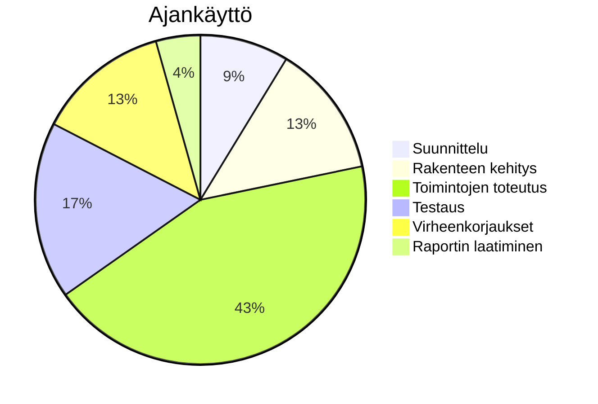

# Loppuraportti

# REACT NATIVE SOVELLUS (OPETUSPELI)

# Iryna Sula

Yleistä

Minun aihe oli tehdä peli. Valitsin kieltenopiskelupelin, jossa lapsi voi tehdä tehtäviä ja saada niistä pisteitä. Sitten, kun hän on tehnyt kaikki tehtävät, hän avaa seuraavan aiheen. Tein React Native -sovelluksen käyttäen Node.js:ää, Knexiä ja SQL:ää.

Opin React Nativen (expo framework) aika hyvin. Minun pitäisi paremmin opetella svg-kuvien tekemistä, tämä osuus ei onnistunut minulla.

• Ajankäyttö: miten ajankäyttösi jakautui projektityössä? Jos mahdollista pyri kuvaamaan ajankäyttö
kaavion avulla.

Общие сведения
• Опишите тему вашего проекта и ваши достижения.
• Что вы думаете о своём успехе, чего вы достигли в ходе проекта?
• Управление временем: как распределялось ваше время в ходе работы над проектом? Если возможно, попробуйте описать ваше управление временем
с помощью диаграммы.

Käyttöliittymä
• Ota kuvaruutukaappaukset tärkeimmistä näkymistä.
• Kerro sanallisesti mitä pelisi objektit ovat (mitä kuvassa näkyy).
• Lisää caption-otsikot kuville.

Пользовательский интерфейс
• Сделайте скриншоты наиболее важных элементов.
• Опишите словами, что представляют собой игровые объекты (что изображено на изображении).
• Добавьте подписи к изображениям.

Työn esittely
• Kirjoita mitä rekrymessujen esittelytilaisuus käsitti, millaiset käytännön järjestelyt olivat, koska
esittely oli jne.
• Miten valmistauduit tapahtumaan
• Millaista oman projektin esitteleminen oli, millaisia kysymyksiä tutustujat esittivät sinulle?
• Tuliko esille esimerkiksi jatkokehitysajatuksia, parannusideoita tms.

Презентация работы
• Опишите, из чего состояла презентация на ярмарке вакансий, каковы были практические аспекты, когда она проходила и т. д.
• Как вы готовились к мероприятию?
• Каково было представлять свой проект, какие вопросы вам задавали люди, с которыми вы встречались?
• Появились ли какие-либо идеи для дальнейшего развития, улучшения и т. д.?

Itsearvio
• Tutkinnon osan Ohjelmiston toteuttaminen komponenttikirjastolla ammattitaitovaatimukset ja
arviointikriteerit löytyvät täältä:
https://eperusteet.opintopolku.fi/#/fi/ammatillinen/6779583/tutkinnonosat/6816830
• Miten tunsit onnistuneesi? Miten arvioit itseäsi kriteerien perusteella?

Самооценка
• Требования к профессиональной компетентности и
критерии оценки для раздела «Реализация программного обеспечения с помощью библиотеки компонентов» можно найти здесь:
https://epursteet.opintopolku.fi/#/fi/ammatillinen/6779583/tuuksinonosat/6816830
• Насколько вы считаете, что достигли успеха? Как бы вы оценили себя на основе этих критериев?
